<!-- Dark is forced. There is deliberately no <picture>/prefers-color-scheme
     switch here: the panels are designed as dark cards, and on a light GitHub
     theme they read as intentional. The light SVGs are still generated and the
     preview page can still toggle to them. -->

<!-- An SVG served through  cannot carry links of its own, so the panel is
     wrapped instead: the "all N repositories" chip is what marks it clickable. -->

<!--
  Every panel is generated, not hand-drawn.

    header.py     profile card; language shares come from the GitHub API and
                  the avatar is inlined as a data URI, because an SVG that
                  references an external image renders empty once GitHub
                  proxies it through Camo
    panels.py     code and footer
    shooter.py    contribution calendar as an arcade shooter
    preview.py    stacks every panel into one page for review

  Cut from the page but still in the source, each one line from returning:
  structure.py (de novo design cascade), and research() and toolchain() in
  panels.py.

  Regenerate everything:   python build.py
  Rebuild one panel:       python shooter.py --user kartic03

  .github/workflows/build.yml refreshes the data-driven panels daily.
-->
