<!-- Generated by panels.py. Edit the generator, not this file: every
     build overwrites it, because the repository tiles and their links come
     from the live repository list.

     Dark is forced. There is no <picture>/prefers-color-scheme switch: the
     panels are designed as dark cards and read as intentional on a light
     GitHub theme. The light SVGs are still generated for the preview page. -->

<!-- Every image is wrapped in an <a> on purpose. GitHub auto-links any image
     that is not already inside one to the raw file in the repo, so an
     unwrapped panel opens as a still SVG when you click it. An <a> with no
     href does not work: GitHub rewrites it into a link to the file.

     The header and the shooter are meant to go nowhere, so they carry a
     fragment that matches nothing on the page. That satisfies the sanitiser,
     suppresses the auto-link, and a browser does not scroll for a fragment
     with no target - unlike href="#", which jumps to the top of the page.

     The target="_blank" below is stripped by GitHub's sanitiser, so links
     open in the same tab here whatever this file says. It is kept because it
     is the correct intent and it does work in dist/page.html and in any
     other renderer. Ctrl-click or middle-click for a new tab on GitHub. -->

<!--
  Every panel is generated, not hand-drawn.

    header.py     profile card; language shares come from the GitHub API and
                  the avatar is inlined as a data URI, because an SVG that
                  references an external image renders empty once GitHub
                  proxies it through Camo
    panels.py     repository tiles, contact chips, and this README
    shooter.py    contribution calendar as an arcade shooter
    preview.py    stacks every panel into one page for review

  Each repository is its own image inside its own <a>. That is not a style
  choice: an SVG served through  cannot carry links, and GitHub's
  sanitiser drops inline <svg>, <object> and image maps, so one card per file
  is the only way each card can point somewhere different. code() in
  panels.py still builds the single-framed-panel version, which looks better
  but sends every card to the same place.

  Every row spans the same width, and gutters are drawn inside the images
  rather than spaced between them, so nothing depends on how wide a browser
  renders the whitespace between two inline images.

  Cut from the page but still in the source, each one line from returning:
  structure.py (de novo design cascade), and research() and toolchain() in
  panels.py.

  Regenerate everything:   python build.py
  Rebuild one panel:       python shooter.py --user kartic03

  .github/workflows/build.yml refreshes the data-driven panels daily.
-->
