<!-- Generated by panels.py. Edit the generator, not this file: every
     build overwrites it, because the repository tiles and their links come
     from the live repository list.

     Dark is forced. There is no <picture>/prefers-color-scheme switch: the
     panels are designed as dark cards and read as intentional on a light
     GitHub theme. The light SVGs are still generated for the preview page. -->

   

<!--
  Every panel is generated, not hand-drawn.

    header.py     profile card; language shares come from the GitHub API and
                  the avatar is inlined as a data URI, because an SVG that
                  references an external image renders empty once GitHub
                  proxies it through Camo
    panels.py     repository tiles, contact chips, and this README
    shooter.py    contribution calendar as an arcade shooter
    preview.py    stacks every panel into one page for review

  The repository cards are one framed panel, so the whole panel links to one
  place: the repositories tab. An SVG served through  cannot carry links
  of its own, and GitHub's sanitiser drops inline <svg>, <object> and image
  maps, so per-card links would mean one image per card and no shared frame.
  code_head(), repo_tile() and code_all() in panels.py still build that
  version if the trade is ever worth making the other way round.

  Cut from the page but still in the source, each one line from returning:
  structure.py (de novo design cascade), and research() and toolchain() in
  panels.py.

  Regenerate everything:   python build.py
  Rebuild one panel:       python shooter.py --user kartic03

  .github/workflows/build.yml refreshes the data-driven panels daily.
-->
